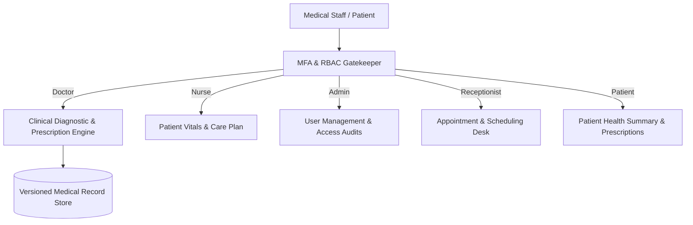

# As-Shifa Clinical EHR & Hospital Management System

Clinical electronic health record (EHR) and hospital administration application featuring role-based access control (RBAC), multi-factor authentication, and immutable clinical record version history.



## Core Architecture

As-Shifa (الشفا) is engineered to solve clinical workflow coordination and regulatory data privacy requirements. The system enforces strict role-based authorization across five operational roles and maintains an append-only audit trail for medical diagnoses.

### Role-Based Access Control (RBAC) Matrix

| Feature / Resource | Doctor | Nurse | Admin | Receptionist | Patient |
| :--- | :---: | :---: | :---: | :---: | :---: |
| View Patient Health Records | Yes | Yes | Yes | No | Self Only |
| Update Medical Diagnoses | Yes | No | Yes | No | No |
| Schedule & Manage Appointments | Yes | No | Yes | Yes | Self Only |
| View & Issue Prescriptions | Yes | Yes | Yes | No | Self Only |
| User Administration & Audit Log | No | No | Yes | No | No |

### Key Capabilities

- **Multi-Factor Authentication (MFA)**: Time-limited one-time password (OTP) verification for clinical staff with automated session countdowns.
- **Medical Record Versioning**: Every diagnostic modification creates an immutable snapshot recording the diagnosing physician, timestamp, and clinical notes.
- **Prescription Tracking**: Active pharmacological schedule management linking patient identifiers with dosage frequencies and administration guidelines.
- **Scheduling Workflow**: Real-time triage of pending and confirmed appointments across clinical staff.

## Technology Stack

- **Frontend**: Semantic HTML5, CSS3 with responsive clinical design tokens
- **Logic**: Vanilla ES6 JavaScript (zero external dependencies)
- **Deployment**: Configured for static hosting on Vercel, Netlify, or Edge CDNs

## Local Execution

Open `index.html` directly in any web browser, or serve via a static web server:

```bash
npx serve .
```
